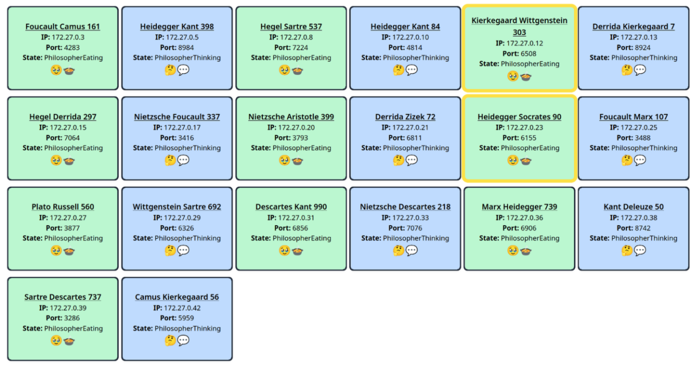

# Distributed Dining Philosophers



## Overview
This repository contains the implementation of the Dining Philosophers problem for Distributed Systems using Rust and direct RPC calls. The project is structured into multiple components, each responsible for different parts of the system. The documentation for the project is provided in the `/docs` folder.

## Project Structure
- **cutlery/**: Contains the source code and configuration for the Cutlery component.
- **docs/**: Contains the documentation for the project, including the Requirements, Design, and Test Documentation (RDT).
- **frontend/**: Contains the frontend code and configuration.
- **shared_menu/**: Contains shared libraries used by different components.
- **waiter/**: Contains the source code and configuration for the Waiter component.
- **philosopher/**: Contains the source code and configuration for the Philosopher component.
- **.github/**: Contains GitHub Actions workflows for CI/CD.

## Building and Running the Project

The project itself was designed to run both natively and in Docker for easier development and deployment. The provided `Makefile` contains targets for building and running the project using Docker Compose. The project can also be built and run natively using the provided `native.sh` script.

To build and run the project, you can use the provided `Makefile`. The following targets are available:

- `all`: Builds and starts all components using Docker Compose.
- `start_waiter`: Builds and starts only the Waiter component.
- `start_philosopher`: Builds and starts only the Philosopher component.
- `clean`: Removes build artifacts and logs.
- `rebuild`: Rebuilds the Docker image.
- `compile_docs`: Compiles the LaTeX documentation.

Example command to start the entire system:
```sh
make up
```

# Continuous Integration
The repository uses GitHub Actions for CI/CD. The workflow defined in rdt.yml compiles the LaTeX documentation and uploads the resulting PDF file.

# Authors
Tom Hert - Tom.Hert@haw-hamburg.de
Laurin Zacharias - Laurin.Zacharias@haw-hamburg.de

# License

This project is licensed under EUPLv1.2 see [HERE](./LICENSE). It may not be used without adhering to the license or explicit permission from the authors. 

**This project is part of a university course. Unlicensed usage of this project to fulfill the course requirements is not allowed and would be considered plagiarism and not adhere to the license! We do not take any responsibility for the consequences of foolish actions and explicitly warn against it!**
